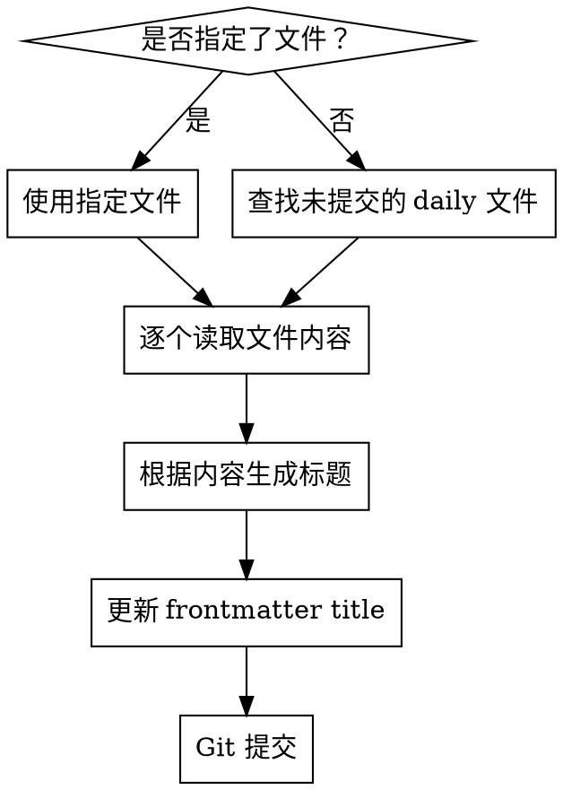

# Daily 标题生成

根据 `src/content/daily/` 下日志文件的实际内容，自动生成有意义的标题并提交。

## 流程

## 文件选择

1. **用户指定了文件：** 直接使用（需确认在 `src/content/daily/` 下）
2. **未指定文件：** 执行 `git status`，收集 `src/content/daily/**/*.md` 下所有未提交（新增/修改）的文件
3. 若没有符合条件的文件，告知用户并停止

## 标题生成规则

- 通读文件全部内容（学习主题、关键收获、标签等）
- 生成简洁的中文标题（30 字以内），概括当日核心主题
- 参照项目现有标题风格：
  - 主题型：`minimind：RMSNorm、RoPE`
  - 活动型：`阅读《从0到1》与《销售就是要玩转情商》`
  - 项目型：`启动opencode web应用项目`
- 如果文件只有模板骨架、没有实质内容，跳过并告知用户
- 禁止使用通用标题如 `日记`、`日志`、`学习记录`

## 提交

- 仅 stage 被修改的 daily 文件
- commit message 格式：`Update daily titles: [简要说明变更]`
- 不要 push

## 速查

| 步骤 | 操作 |
|------|------|
| 1 | 确定目标文件（指定 or 未提交） |
| 2 | 读取每个文件的内容 |
| 3 | 根据内容主题生成标题 |
| 4 | 修改 frontmatter `title` 字段 |
| 5 | `git add` + `git commit` |
